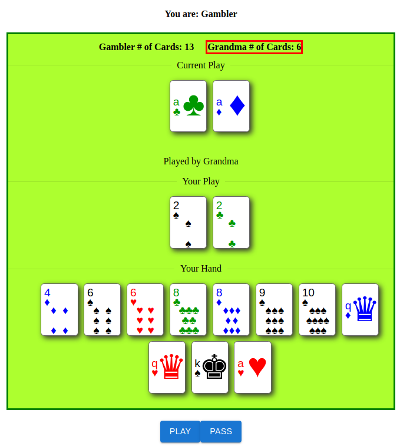

# Big 2 (Tien Len version)

## How to Play

[Rules](https://www.wikihow.com/Play-Tien-Len)

## Contents

This is a monorepo containing a React frontend and an Express backend. The frontend communicates with the backend using both HTTP and WebSockets through Apollo GraphQL. The backend handles data permanence using MongoDB. There's an attached Dockerfile to create a build image if needed.

## How to Setup the App

### Local Development

1. Download and install MongoDB
2. Modify and change /backend/.env.template -> /backend/.env
3. Run `npm install` in both /frontend and /backend
4. Start MongoDB server
5. Run `npm run dev` in /backend (uses port defined in .env)
6. Run `npm start` in /frontend (uses port 3000)

### Deploy using Dockerfile (Docker)

1. Install Docker Engine/Desktop. Use CLI for the following steps
2. Run `docker build -t <image> .` in root folder
3. Tag image using `docker tag <image ID/name> <image ID/name:versioning>`
4. Push up the container into DockerHub (optional)
5. Pull/get the container in host machine/web server
6. Run `docker run -p 80:80 <docker container with tag if added>`
7. If the reverse proxy has been set up correctly then the app will be deployed according to its configuration using port 80 (HTTP)

ps: Requires MongoDB to be installed as well as .env configured on the host machine/web server

## Credits

Made using [CSS-Playing-Cards](https://github.com/selfthinker/CSS-Playing-Cards/blob/master/cards.css)
